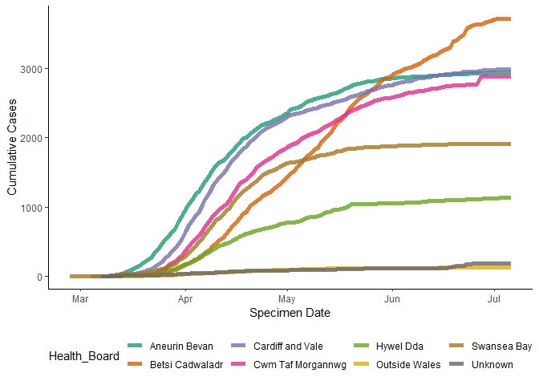
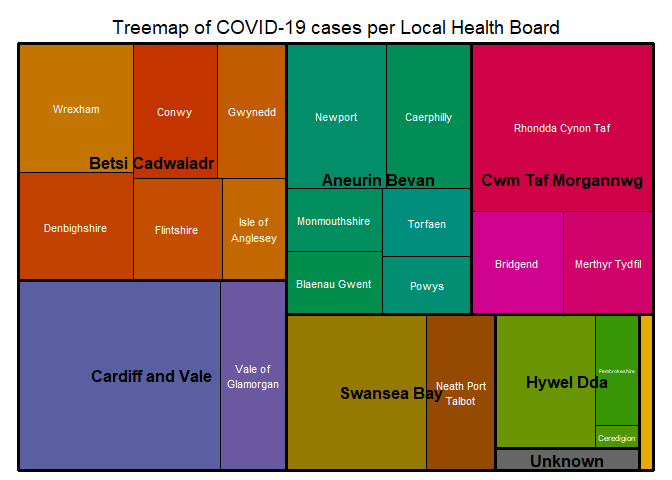
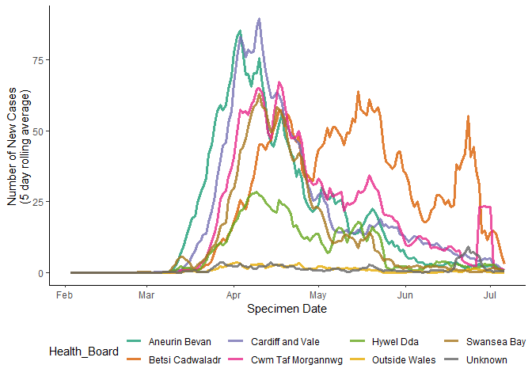

COVID-19 Data Analysis
================
TW
18 June 2020

### Load Data

``` r
#importing each sheet seperately
Cumulative_Cases=read_excel("Rapid COVID-19 surveillance data.xlsx", 3)
Age_Sex = read_excel("Rapid COVID-19 surveillance data.xlsx", 4)
Deaths_Date = read_excel("Rapid COVID-19 surveillance data.xlsx", 5)
Deaths_LHB = read_excel("Rapid COVID-19 surveillance data.xlsx", 6)
```

### Reformat Data

``` r
colnames(Cumulative_Cases) = gsub(' ','_',colnames(Cumulative_Cases))
colnames(Cumulative_Cases)[3] = 'New_Cases'
colnames(Age_Sex) = gsub(' ','_',colnames(Age_Sex))
colnames(Deaths_Date) = gsub(' ','_',colnames(Deaths_Date))
colnames(Deaths_LHB) = gsub(' ','_',colnames(Deaths_LHB))

Cumulative_Cases$Specimen_date = gsub(' UTC','',Cumulative_Cases$Specimen_date)
Cumulative_Cases$Specimen_date = as.Date(Cumulative_Cases$Specimen_date,'%Y-%m-%d')
Cumulative_Cases$Local_Authority = as.factor(Cumulative_Cases$Local_Authority)

Deaths_Date$Date_of_death = gsub(' UTC','',Deaths_Date$Date_of_death)
Deaths_Date$Date_of_death = as.Date(Deaths_Date$Date_of_death,'%Y-%m-%d')
```

### Adding 'Local Health Board' annotation for easier graphing

``` r
Cumulative_Cases$Health_Board = c(rep('Aneurin Bevan',summary(Cumulative_Cases$Local_Authority)[1]),
                                  rep('Cwm Taf Morgannwg',summary(Cumulative_Cases$Local_Authority)[1]),
                                  rep('Aneurin Bevan',summary(Cumulative_Cases$Local_Authority)[1]),
                                  rep('Cardiff and Vale',summary(Cumulative_Cases$Local_Authority)[1]),
                                  rep('Hywel Dda',summary(Cumulative_Cases$Local_Authority)[1]),
                                  rep('Hywel Dda',summary(Cumulative_Cases$Local_Authority)[1]),
                                  rep('Betsi Cadwaladr',summary(Cumulative_Cases$Local_Authority)[1]),
                                  rep('Betsi Cadwaladr',summary(Cumulative_Cases$Local_Authority)[1]),
                                  rep('Betsi Cadwaladr',summary(Cumulative_Cases$Local_Authority)[1]),
                                  rep('Betsi Cadwaladr',summary(Cumulative_Cases$Local_Authority)[1]),
                                  rep('Betsi Cadwaladr',summary(Cumulative_Cases$Local_Authority)[1]),
                                  rep('Cwm Taf Morgannwg',summary(Cumulative_Cases$Local_Authority)[1]),
                                  rep('Aneurin Bevan',summary(Cumulative_Cases$Local_Authority)[1]),
                                  rep('Swansea Bay',summary(Cumulative_Cases$Local_Authority)[1]),
                                  rep('Aneurin Bevan',summary(Cumulative_Cases$Local_Authority)[1]),
                                  rep('Outside Wales',summary(Cumulative_Cases$Local_Authority)[1]),
                                  rep('Hywel Dda',summary(Cumulative_Cases$Local_Authority)[1]),
                                  rep('Aneurin Bevan',summary(Cumulative_Cases$Local_Authority)[1]),
                                  rep('Cwm Taf Morgannwg',summary(Cumulative_Cases$Local_Authority)[1]),
                                  rep('Swansea Bay',summary(Cumulative_Cases$Local_Authority)[1]),
                                  rep('Aneurin Bevan',summary(Cumulative_Cases$Local_Authority)[1]),
                                  rep('Unknown',summary(Cumulative_Cases$Local_Authority)[1]),
                                  rep('Cardiff and Vale',summary(Cumulative_Cases$Local_Authority)[1]),
                                  rep('Betsi Cadwaladr',summary(Cumulative_Cases$Local_Authority)[1]))
```

### Cumulative cases per health board

``` r
Cumualtive_Cases_Health_Board=aggregate(Cumulative_cases ~  Health_Board + Specimen_date, data=  Cumulative_Cases, sum)

ggplot(Cumualtive_Cases_Health_Board,aes(x = Specimen_date, y = Cumulative_cases)) +  
         geom_line(aes(color = Health_Board),
                   size=1.1,alpha=0.8) +
  theme_classic() +
  xlab('Specimen Date') +
  ylab('Cumulative Cases') +
  theme(legend.position = 'bottom') +
  scale_color_brewer(palette = 'Dark2')
```

 \#\#\# New cases per health board

``` r
New_Cases_Health_Board=aggregate(New_Cases ~  Health_Board + Specimen_date, data=  Cumulative_Cases, sum)
New_Cases_Health_Board = New_Cases_Health_Board[order(New_Cases_Health_Board$Health_Board),]

Plotting_Data=matrix(nrow=nrow(New_Cases_Health_Board),ncol=1)
colnames(Plotting_Data) = 'New_Case_Average'
for(i in 1:length(unique(New_Cases_Health_Board$Health_Board))) {
  Subsetted_Data=subset(New_Cases_Health_Board,
                        Health_Board == unique(New_Cases_Health_Board$Health_Board)[i])
  Plotting_Data[((nrow(Subsetted_Data) * i ) - (nrow(Subsetted_Data) - 1)) : (nrow(Subsetted_Data) * i ),1] = 
    pracma::movavg(Subsetted_Data$New_Cases,5,'s')
  }
Plotting_Data = as.data.frame(Plotting_Data)
Plotting_Data$Health_Board=New_Cases_Health_Board$Health_Board
Plotting_Data$Specimen_date=New_Cases_Health_Board$Specimen_date

ggplot(Plotting_Data,aes(x = Specimen_date, y = New_Case_Average)) +  
         geom_line(aes(color = Health_Board),
                   size=1.1,alpha=0.8) +
  theme_classic() +
  xlab('Specimen Date') +
  ylab('Number of New Cases \n(5 day rolling average) ') +
  theme(legend.position = 'bottom') +
  scale_color_brewer(palette = 'Dark2')
```



### Cases by age and sex

``` r
Age_Sex2=Age_Sex[!Age_Sex$Cases == 0,]
Age_Sex2$Age_group = factor(Age_Sex2$Age_group, levels= c('<10','10-19','20-29','30-39','40-49','50-59',
                                                          '60-69','70-79','80-89','90-99','100+','Unknown'))

ggplot(Age_Sex2, aes(x=Cases,
                    y=Age_group)) + 
  geom_point(size=15, alpha=0.6, shape=21, color='black', aes(fill=Sex)) +
  xlab('Cases') +
  ylab('Age Group') +
  scale_x_log10() +
  theme_classic() +
  theme(legend.position = 'bottom') +
  scale_fill_brewer(palette = 'Dark2')
```


